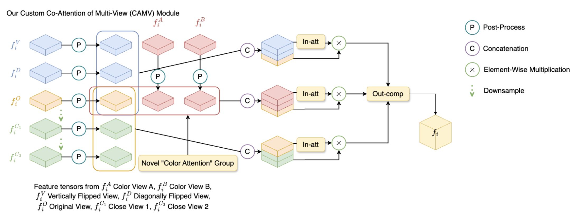

## Exploring Color Modification in Multi-view Feature Fusion Networks

Utilizing PyTorch, we build upon [Multi-view Feature Fusion Network for Camouflaged Object Detection](https://openaccess.thecvf.com/content/WACV2023/papers/Zheng_MFFN_Multi-View_Feature_Fusion_Network_for_Camouflaged_Object_Detection_WACV_2023_paper.pdf), taking the existing distance and angle-based viewing perspectives and adding a "color view," applying the model to the ACD1K dataset. As a result, we implement a **color attention** in order to preserve the model's understanding of color-based features during feature-combination within the model's characteristic Co-attention of Multi-view (CAMV) model.

Full results of this CS 231N final project, along with model improvements resulting from dataset expansion and pixel-based noramlization, can be viewed in the following [paper](https://github.com/nathanjzhao/ColorView/blob/master/readme/Exploring%20Color%20Modification%20in%20Multi-view%20Feature%20Fusion%20Networks.pdf))

